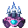

# Mundane Blaster 

**Mundane Blaster** is a 2D browser game built using Phaser 3, created for the [Dev.to Community Web Game Challenge](https://dev.to/). This project started as a way to learn more about Phaser and web game development, with the initial foundation based on a tutorial, but I try to make it unique.

## Demo

You can play **Mundane Blaster** online: [Mundane Blaster Game](https://chirag8023.github.io/mundane-blaster/).
|   |   |
| ----------- | ----------- |

## How to Play

1. Use the arrow keys move character.
2. Press spacebar to fire blasts at enemies.
3. Collect power-ups for bonus points.
4. Enjoy!
   
## Credits

- **Tutorial Inspiration**: [Youtube Phaser Tutorial](https://www.youtube.com/playlist?list=PLDyH9Tk5ZdFzEu_izyqgPFtHJJXkc79no) – I followed this tutorial as the foundation and then expanded upon it to create **Mundane Blaster**.
- **Assets**: Game assets are borrowed from [Ansimuz](https://www.youtube.com/@ansimuz).

## License

This project is licensed under the MIT License. See the [LICENSE](LICENSE) file for more information.
